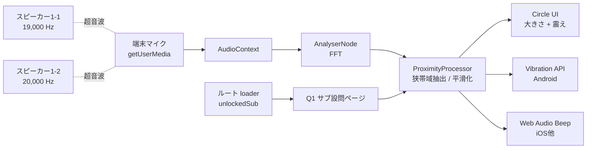
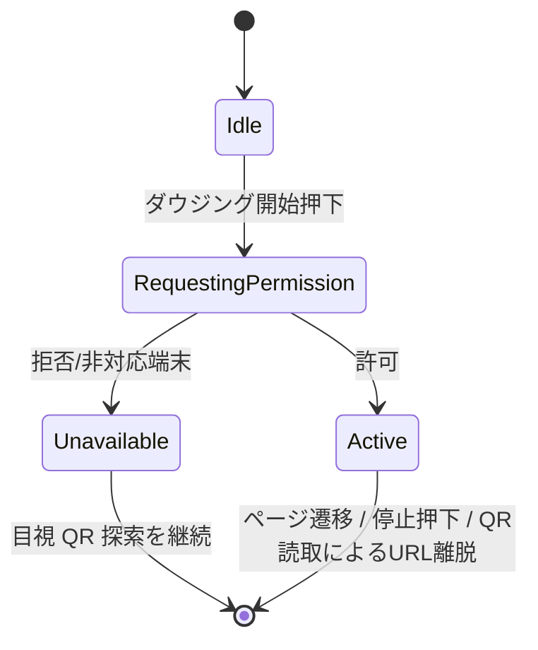

# 設計書: ダウジング機能（設問1詳細化）

author: nagomu
status: draft
updatedAt: 2026.04.30

---

## 1. 目的と前提

本書は `specs.md` 6.2（設問1: 二重ロック解除）の「ダウジング機能」を実装可能な技術仕様に落とし込むための設計書である。
対象は来場者向けモバイルブラウザ体験のうち、室内に隠されたQR地点へ来場者を音響的に誘導する部分。

採用前提:

- 実行環境: モバイルブラウザ（来場者端末）
- フロントエンド: React Router Framework Mode（既存採用）
- ページ遷移ベースで完結させ、新規 API エンドポイントは追加しない
- 利用Web API: `getUserMedia`（マイク入力）、Web Audio API（FFT、効果音生成）、Vibration API（Android）
- サブ設問の完了判定は既存の React Router action（`routes/q1.$sub.checkpoint.tsx` の POST）に集約し、本機能は「探索体験の演出」のみを担う
- 1-1 / 1-2 の対象地点には超音波スピーカーとQRコードを共置する
- バイブレーションはAndroid端末のみ提供する。iOS等のVibration API非対応端末は効果音で代替する
- マイク許可が得られない端末ではダウジング UI を非表示にし、目視でQRを探す案内のみ表示する。完了経路の記録（method 等）は行わない

---

## 2. 機能概要

### 2.1 ユースケース

来場者は対応するサブ設問の解答入力後、画面の「ダウジング開始」ボタンを押下する。マイク許可を得て、室内に隠された対象QR地点へ近づくと、画面中央の円が「大きさ」「震え振幅」で接近度を表現し、Android端末は「バイブ間隔」、iOS等は「効果音間隔」で接近度を聴覚/触覚に伝える。来場者は信号が最大になる地点でQRコードを読み取り、開いたチェックポイント URL の `VERIFY CHECKPOINT` ボタン押下でサブ設問を完了する。

### 2.2 体験フロー

```mermaid
flowchart TD
sub[サブ設問画面 /q1/:sub] --> answer[解答送信 form action]
answer --> wait[同画面で AWAITING PHYSICAL VERIFICATION 表示]
wait --> dowsing[ダウジングカード上で開始ボタン押下]
dowsing --> perm{マイク許可}
perm -- 許可 --> active[ダウジング起動: 円+震え+バイブ/効果音]
perm -- 拒否/非対応 --> guide[マイクが使えない案内表示・QR目視で探索]
active --> read[対象 QR を読み取り]
guide --> read
read --> cp[/q1/:sub/checkpoint?code=XXX を開く]
cp --> verify[VERIFY CHECKPOINT 押下 form action]
verify --> next{両サブ設問完了?}
next -- 未 --> sub
next -- 完 --> q2[Q2 解放]
```

ページ遷移境界でダウジングは停止し、次のサブ設問ページで対象周波数を切り替えて再起動する。

### 2.3 スコープ

In Scope:

- ダウジング機能のクライアント実装（円ビュー・バイブ・効果音・マイク権限ハンドリング）
- 1-1 / 1-2 の周波数別評価（ルート単位で定数を切替）
- 計測不能/権限拒否時の案内表示
- 設定パラメータ定義

Out of Scope:

- 完了判定エンドポイントの新規追加（既存 `routes/q1.$sub.checkpoint.tsx` の form action を流用）
- JSON API の新設（`GET /api/v1/progress` 等は導入しない）
- 完了経路（ダウジング/目視）のサーバ側記録
- スピーカーハードウェア選定・設置運用（運営側設備として別管理）
- AR描画やカメラ利用

---

## 3. アーキテクチャ

### 3.1 構成



サーバ側は既存の loader（`routes/q1.tsx` / `routes/q1.1.tsx` / `routes/q1.2.tsx` / `routes/q1.$sub.checkpoint.tsx`）のみで完結する。クライアントから周期 fetch する API は持たない。

### 3.2 責務分離

- 音声入出力層: `getUserMedia`、`AudioContext`、`AnalyserNode` の生成・解放
- 解析層: 狭帯域フィルタ、対象周波数ピーク振幅抽出、底ノイズ補正、平滑化、接近度算出
- 出力層: 円の状態（大きさ・震え振幅）、Vibration API パターン、効果音間隔
- 制御層: 起動/停止、ページ遷移時のクリーンアップ、マイク不可時の案内切替

### 3.3 設計原則

- 完了判定はサーバが唯一の正データソース。クライアント側ダウジング状態は完了に影響しない。
- 解放されていないサブ設問の周波数は完全に無視する（誤反応防止）。対象周波数はルート単位で固定。
- マイクストリームは端末内処理のみで完結。録音・送信は行わない。
- すべての可調パラメータは仕様パラメータ表（§7）で管理し、初期は静的定数として埋め込む。
- 新規 API/エンドポイント/DB カラムは追加しない（現アーキテクチャ維持）。

### 3.4 クライアント状態



ページ遷移により AudioContext と MediaStream は確実にクローズされる。サブ設問の切替（1-1 → 1-2）はルート切替で表現し、新ページの初期化時に対象周波数を読み込む。

---

## 4. 信号仕様

### 4.1 周波数割当

- 1-1 サブ設問: 18,600 Hz（中心、初期値）
- 1-2 サブ設問: 20,000 Hz（中心、初期値）
- 18 kHz 以下は若年層に明瞭に可聴のため避け、20 kHz 以上は端末マイクの高域減衰でほぼ取れないため上限とする。中間幅 1,400 Hz 取ることで隣接設問の混信を実質ゼロにする。
- 上記は実体検証で端末マイクの平坦帯域に合わせて再調整しうる（17〜21kHz 範囲で代替候補を持つ）。

対象周波数はルート（`q1.1.tsx` / `q1.2.tsx`）ごとに静的定数で埋め込む。実行時の周波数切替は行わない。

参照帯域（誤検知抑制用）:

- 各 target の `+400 Hz` を「環境ノイズ参照」として常時計測する（Q1-1 → 19,000 Hz / Q1-2 → 20,400 Hz）。
- どちらも可聴域には落ちず、相手側 target の帯域とも重ならない。
- 参照帯域が大きくスパイクしたら、信号側の magnitude を動的に減衰させる（§4.3）。

### 4.2 スピーカー側発信

- 各地点で連続正弦波を発信する。
- 出力レベルは `1〜3 m` で接近検知が可能、隣接設問の混信が最小となる値に運営側で調整する（最終値は実体検証）。
- 1-1 / 1-2 の同時鳴動を許容する（端末側で帯域分離する）。
- 起動・停止時は `linearRampToValueAtTime` で `TONE_FADE_MS` (= 10 ms) の fade in/out を行い、クリックノイズ（高域スパッタリング）を抑制する。
- 運営向けにアプリ内テストトーン発生ページ `/operator/dowsing-test` を提供（端末スピーカーから 18.6 / 20 kHz を出力可能・出力レベルスライダー付き）。

### 4.3 端末側受信・解析

AnalyserNode 設定:

- `fftSize`: 8192（48kHzサンプリング時の周波数解像度 ≒ 5.86 Hz / bin）
- `smoothingTimeConstant`: 0.0（自前で平滑化する）

狭帯域抽出（エネルギー合計）:

- 中心周波数 ± `energy_half_bins` (= 5 bin、≒ ±29 Hz @ 48 kHz) の bin を評価
- 各 bin の dB 値を `magnitude = 10^(dB/20)` で線形変換し、合計値を帯域エネルギーとする
- ピーク値ではなく合計値を使うことで、単発の鋭いスパイクではなく定常的な信号にだけ反応しやすくなる

底ノイズ補正:

- 起動直後 `noise_window_ms` をキャリブレーション窓とし、target / 参照帯域それぞれのエネルギー合計の中央値を `noise_mag` / `ref_noise_mag` として保存
- 評価時は `sig_mag = max(0, target_mag - noise_mag)`

参照帯域による動的減衰:

- 参照帯域の `ref_spike_db = 20 * log10(ref_mag / ref_noise_mag)`
- `ref_spike_db > REF_GUARD_DB` (= 9 dB) のとき、target に「広帯域ノイズが漏れ込んでいる」とみなし `adjusted_mag = max(0, sig_mag - noise_mag * 10^(REF_THRESHOLD_BOOST_DB/20))` で減衰
- これにより擦れ音・拍手などの広帯域突発音による誤反応を抑える

接近度マッピング（線形 magnitude）:

- 設計レンジ `[LINEAR_RANGE_MIN, LINEAR_RANGE_MAX]` に対し `adjusted_mag` を 0〜100 に線形マッピング
- レンジ外はクランプ
- dB ではなく線形 magnitude にすることで、距離変化による音圧の指数変化に対し proximity の応答が自然になる

平滑化:

- 指数移動平均（EMA）`proximity = (1 - α) * prev + α * raw`
- `α = ema_alpha`（実体検証で 0.2〜0.4）

デバッグ出力:

- dev 環境のみ `DEBUG_LOG_INTERVAL_MS` (= 250 ms) 周期で
  `console.log("[dowsing]", { targetMag, noiseMag, sigMag, refMag, refNoiseMag, spikeDb, adjustedMag, proximity })` を出力
- 現地でレンジ調整するときの実測値取得に使う

### 4.4 サブ設問切替

- ページ遷移によりルートが切り替わると、AudioContext は破棄され、新しいルートが定義する周波数定数で再起動される。
- 1-1 完了 → ハブ画面 `/q1` → 1-2 開始の流れで自然にマイクの再起動とキャリブレーションが実施される。
- ポーリングや SSE は不要。

---

## 5. 出力仕様

### 5.1 円ビュー

- 画面中央に円を1つ表示する（両サブ設問共通の単一ビュー）。
- 大きさ: `R = R0 + (R1 - R0) * (proximity / 100) * circle_size_coef`（クランプ）
- 震え: 振幅 `A = A_max * (proximity / 100) * circle_shake_coef` で X/Y 軸ランダム変位アニメーション
- レンダリング: CSS `transform: translate(...) scale(...)` を `requestAnimationFrame` で更新
- 接近度の数値は表示しない（探索体験を維持するため）

### 5.2 バイブレーション（Android）

検出条件:

- `'vibrate' in navigator` が真
- `navigator.userAgent` に `Android` を含む

「強さ」表現はパルス間隔短縮で行う（Vibration APIに強度パラメータがないため）。

マッピング:

- `pulse_ms = vib_pulse_ms`（固定）
- `gap_ms = clamp(vib_gap_max_ms - (vib_gap_max_ms - vib_gap_min_ms) * proximity / 100, vib_gap_min_ms, vib_gap_max_ms)`
- 連続トリガ: 500ms ごとに `navigator.vibrate([pulse_ms, gap_ms, pulse_ms, gap_ms, ...])` を再呼び出し

円・バイブ・効果音の係数はそれぞれ独立に調整可能とする（§7参照）。

### 5.3 効果音（iOS等バイブ非対応端末）

- Web Audio API の `OscillatorNode` で 880 Hz 程度の短いビープを生成
- 接近度に応じてビープ間隔を短縮（マッピングはバイブと同形）
- 出力音量は中域に固定

### 5.4 起動と権限

- 「ダウジング開始」ボタン押下を起点とする（iOS Safari は AudioContext / getUserMedia ともにユーザージェスチャー必須）。
- 起動シーケンス:
  1. `navigator.mediaDevices.getUserMedia({ audio: { echoCancellation: false, noiseSuppression: false, autoGainControl: false } })`
  2. `new AudioContext()`
  3. `MediaStreamSource` -> `AnalyserNode` を接続
  4. キャリブレーション窓を実行（`noise_window_ms`）
  5. 評価ループ開始（`tick_ms` 周期）
- 停止シーケンス:
  - `MediaStreamTrack.stop()`
  - `AudioContext.close()`
  - `cancelAnimationFrame`
  - `navigator.vibrate(0)`（バイブ停止）
  - ページ遷移時はクリーンアップ関数（React の `useEffect` cleanup）で自動実行

### 5.5 マイクが使えない場合の挙動

マイク許可拒否、ブラウザ非対応、`getUserMedia` 失敗のいずれの場合も同一動線とする。

- ダウジングカードを次の表示に切り替える:
  - 見出し: 「ダウジングを利用できません」
  - 本文: 「室内に隠されたQRコードを目視で探して読み取ってください。」
  - 補足（任意）: 「マイクの許可を有効にするとダウジングを使えます。」のリンクで OS 別手順アコーディオンを開く
- 円・バイブ・効果音は表示・実行しない
- サーバ側のデータ・処理は変化しない（method 記録なし、別ルートにも遷移しない）
- QR を見つけて読み取れば、通常通り `/q1/:sub/checkpoint?code=XXX` が開きサブ設問が完了する

---

## 6. クライアント実装

### 6.1 コンポーネント候補

- `DowsingButton`: 起動/停止トリガ
- `DowsingCircle`: 接近度購読 + 円描画
- `DowsingHapticController`: Vibration API 呼び出し（Android）
- `DowsingFallbackBeep`: Web Audio API ビープ（iOS等）
- `DowsingUnavailableMessage`: マイク不可時の案内文
- `useProximity(targetFreqHz)`: AudioContext + AnalyserNode を内包し、接近度ストリームを返す hook

ルート (`routes/q1.1.tsx` / `routes/q1.2.tsx`) は対象周波数定数を import して `useProximity` に渡す。

### 6.2 評価ループ擬似コード

```ts
function startDowsing(targetFreqHz: number) {
  const stream = await navigator.mediaDevices.getUserMedia({
    audio: {
      echoCancellation: false,
      noiseSuppression: false,
      autoGainControl: false,
    },
  });
  const ctx = new AudioContext();
  const src = ctx.createMediaStreamSource(stream);
  const analyser = ctx.createAnalyser();
  analyser.fftSize = FFT_SIZE;
  analyser.smoothingTimeConstant = 0;
  src.connect(analyser);

  const { noiseMag, refNoiseMag } = await calibrate(
    analyser,
    targetFreqHz,
    NOISE_WINDOW_MS,
  );
  let proximity = 0;

  const tick = () => {
    const targetMag = bandEnergyMagnitude(analyser, targetFreqHz);
    const refMag = bandEnergyMagnitude(
      analyser,
      targetFreqHz + REF_FREQ_OFFSET_HZ,
    );
    const sigMag = Math.max(0, targetMag - noiseMag);
    const spikeDb = refSpikeDb(refMag, refNoiseMag);
    const adjusted = attenuateBySpike(
      sigMag,
      noiseMag,
      spikeDb,
      REF_GUARD_DB,
      REF_THRESHOLD_BOOST_DB,
    );
    const raw =
      clamp(
        (adjusted - LINEAR_RANGE_MIN) / (LINEAR_RANGE_MAX - LINEAR_RANGE_MIN),
        0,
        1,
      ) * 100;
    proximity = (1 - EMA_ALPHA) * proximity + EMA_ALPHA * raw;
    publish(proximity);
    rafHandle = requestAnimationFrame(tick);
  };
  tick();
}
```

### 6.3 ルート別周波数の指定

```ts
// routes/q1.1.tsx
const TARGET_FREQ_HZ = FREQ_Q1_1_HZ;

// routes/q1.2.tsx
const TARGET_FREQ_HZ = FREQ_Q1_2_HZ;
```

実行時切替は不要（ページ遷移で自然に切り替わる）。

### 6.4 エラー分類とハンドリング

| エラー                 | 想定原因         | クライアント挙動                    |
| ---------------------- | ---------------- | ----------------------------------- |
| `NotAllowedError`      | ユーザー拒否     | 「利用できません」案内表示          |
| `NotFoundError`        | マイク未搭載     | 「利用できません」案内表示          |
| `NotReadableError`     | 他アプリが使用中 | 「利用できません」案内表示          |
| `OverconstrainedError` | 制約過剰         | 制約緩めて再試行 → 失敗時は案内表示 |
| AudioContext 生成失敗  | ブラウザ非対応   | 「利用できません」案内表示          |

すべて同一の `DowsingUnavailableMessage` に集約し、再許可説明アコーディオンを補助的に併設する。

---

## 7. 仕様パラメータ

| 名前                       | 既定値（暫定） | 説明                                                       |
| -------------------------- | -------------- | ---------------------------------------------------------- |
| `FREQ_Q1_1_HZ`             | 18600          | サブ設問1-1の中心周波数                                    |
| `FREQ_Q1_2_HZ`             | 20000          | サブ設問1-2の中心周波数                                    |
| `ENERGY_HALF_BINS`         | 5              | 中心 ± この bin 数を狭帯域として線形 magnitude 合計        |
| `FFT_SIZE`                 | 8192           | AnalyserNode FFTサイズ                                     |
| `REF_FREQ_OFFSET_HZ`       | 400            | 参照帯域の中心 = target + これ（Hz）                       |
| `REF_GUARD_DB`             | 9              | 参照帯域がこの dB 以上スパイクしたら動的減衰を発動         |
| `REF_THRESHOLD_BOOST_DB`   | 6              | 動的減衰量（信号 magnitude から noise×10^(boost/20) を減算）|
| `NOISE_WINDOW_MS`          | 1500           | キャリブレーション窓長                                     |
| `LINEAR_RANGE_MIN`         | 0.0            | proximity=0 にマップする線形 magnitude（実体検証で確定）   |
| `LINEAR_RANGE_MAX`         | 0.05           | proximity=100 にマップする線形 magnitude（暫定）           |
| `EMA_ALPHA`                | 0.3            | 接近度EMA係数                                              |
| `TICK_MS`                  | 60             | 評価ループ周期                                             |
| `DEBUG_LOG_INTERVAL_MS`    | 250            | dev 環境のデバッグログ throttle 周期                       |
| `CIRCLE_SIZE_MIN_PX`       | 80             | 円の最小直径                                               |
| `CIRCLE_SIZE_MAX_PX`       | 240            | 円の最大直径                                               |
| `CIRCLE_SHAKE_MAX_PX`      | 12             | 震え振幅最大値                                             |
| `CIRCLE_SIZE_COEF`         | 1.0            | 円サイズ感度係数（独立調整）                               |
| `CIRCLE_SHAKE_COEF`        | 1.0            | 震え振幅感度係数（独立調整）                               |
| `VIB_PULSE_MS`             | 100            | バイブパルス長（固定）                                     |
| `VIB_GAP_MIN_MS`           | 60             | proximity=100時のパルス間隔                                |
| `VIB_GAP_MAX_MS`           | 800            | proximity=0時のパルス間隔                                  |
| `BEEP_FREQ_HZ`             | 880            | iOSフォールバック ビープ周波数                             |
| `BEEP_PULSE_MS`            | 80             | ビープパルス長                                             |
| `BEEP_GAP_MIN_MS`           | 80             | proximity=100時のビープ間隔                                |
| `BEEP_GAP_MAX_MS`           | 900            | proximity=0時のビープ間隔                                  |
| `BEEP_FADE_MS`             | 10             | ビープ起動・停止のクリックノイズ防止 fade                  |
| `TONE_FADE_MS`             | 10             | テストトーン (`/operator/dowsing-test`) の fade in/out     |
| `TONE_DEFAULT_LEVEL`       | 0.3            | テストトーン初期出力レベル                                 |

設計レンジは `specs.md` 6.2 の運用要件と整合させ、接近開始 1〜3m / 最大 〜30cm を狙う。最終値はすべて実体検証で確定する。

---

## 8. UI仕様

### 8.1 サブ設問画面（変更点）

- 既存の解答入力欄に加え、ダウジングカードを表示する
  - タイトル: 「ダウジングで地点を探す」
  - 説明: 「『ダウジング開始』を押すと、対象に近づくほど画面の円が大きく震えます。Android端末ではスマホが振動します。」
  - ボタン: 「ダウジング開始」
- 起動後はカード内が円ビュー + 「停止」ボタンに切り替わる
- マイク不可時は §5.5 の案内文に切り替わる

### 8.2 円ビュー

- 縦持ち端末で画面中央に正円を1つ表示
- 1-2 ページに遷移してから新しい周波数で再起動した場合も、円の見た目（色・パターン）を維持し、画面文言だけ「次の地点を探してください」に変える
- 接近度の数値・メーターは表示しない

### 8.3 マイク不可時の案内

- 「ダウジングを利用できません」「室内に隠されたQRコードを目視で探して読み取ってください」を主表示
- 補助として OS別マイク許可手順アコーディオンを併設（任意で開閉）
- 専用画面遷移は行わない（同じサブ設問画面上でカードのみ差し替え）

### 8.4 表示テキスト（抜粋）

- 「ダウジングで地点を探す」
- 「マイクの音声は端末内処理のみで、サーバには送信されません。」
- 「ダウジングを利用できません。室内に隠されたQRコードを目視で探して読み取ってください。」

---

## 9. 非機能要件・端末対応

### 9.1 ブラウザ互換性

| ブラウザ            | getUserMedia | AudioContext         | Vibration | 採用方針                       |
| ------------------- | ------------ | -------------------- | --------- | ------------------------------ |
| Android Chrome      | 対応         | 対応                 | 対応      | フル機能                       |
| iOS Safari          | 対応         | 対応（要ジェスチャ） | 非対応    | 円 + 効果音                    |
| iOS Chrome (WebKit) | 対応         | 対応                 | 非対応    | 円 + 効果音                    |
| Android Firefox     | 対応         | 対応                 | 部分対応  | 円 + 効果音（バイブ条件付き）  |
| その他              | 要確認       | 要確認               | 要確認    | 「利用できません」案内表示のみ |

### 9.2 性能

- 評価ループ p95 16ms 以内（60fps を阻害しない）
- 起動から最初の接近度出力まで p95 2.5秒以内（キャリブレーション窓含む）
- バイブ再呼び出し周期（500ms）でメインスレッドを長時間占有しない
- ページ遷移時のクリーンアップは 100ms 以内で完了（mic ホールドが残らない）

### 9.3 プライバシ

- マイクストリームは録音・送信しない（クライアント解析のみ）
- 解析結果（接近度・周波数）もサーバに送信しない
- 完了経路（ダウジング/目視）も記録しない
- マイク使用中はOS標準のインジケータが表示されることを許容（説明文に補足）

### 9.4 端末負荷

- 評価ループは `requestAnimationFrame` で駆動、ページ非アクティブ時は停止
- 不要時に `AudioContext.close()` と `MediaStreamTrack.stop()` を呼ぶ
- 連続稼働時間は最大10分を想定（Q1滞留の上限を超える場合は再起動を促す）

### 9.5 アクセシビリティ

- バイブ非対応・音響制限（消音設定）の場合は円の視覚演出のみで進められる
- マイクが使えない端末でも目視探索でゲームは完遂できる（ダウジングは必須機能ではない）

---

## 10. 受け入れ条件（Given/When/Then）

- Given Q1の対応サブ設問解放中, When 「ダウジング開始」押下後にマイクが許可される, Then 対応周波数の評価ループが開始する。
- Given 評価ループ稼働中, When 端末が音源に近づき信号が強まる, Then 接近度が単調増加し、円の大きさ・震え振幅が増加する。
- Given Android端末で評価ループ稼働中, When 接近度が高まる, Then `navigator.vibrate` のパルス間隔が短縮される。
- Given バイブ非対応端末, When 接近度が高まる, Then 効果音のビープ間隔が短縮される。
- Given 1-1 完了直後, When ハブを経由して 1-2 ページに遷移, Then 評価対象周波数が 1-2 中心周波数に切り替わって再起動される。
- Given 解放中サブ設問の音源だけが鳴っている, When 未解放側の周波数も同時受信する状況, Then 解放中側信号にのみ反応する。
- Given 短時間の環境ノイズ, When 接近度を計算, Then 平滑化により急峻な変化が抑制され、円の表示が暴れない。
- Given マイク許可拒否または非対応端末, When 「ダウジング開始」押下または起動試行, Then 「ダウジングを利用できません」案内が表示され、目視探索を促す。
- Given 評価ループ稼働中, When ページ遷移もしくはタブ非アクティブ化, Then マイクストリームと AudioContext がクローズされる。
- Given 任意の探索方法（ダウジング/目視）でQRを発見, When 対象地点のQRを読み取り `/q1/:sub/checkpoint?code=XXX` を開いて VERIFY CHECKPOINT を押下, Then 既存 form action でサブ設問が完了する。

---

## 11. 既存仕様との整合

- `specs.md` 6.2.1 の「音源検出はQ1の必須ギミック」「平滑化」「別周波数」「フォールバックQR」要件のうち、フォールバック専用モード/専用エンドポイントは廃し、目視探索を共通動線として組み込む。
- `specs.md` 6.2.1 の「外周点滅周期」「数値メーター」表現は本書の「円・バイブ・効果音」表現で置換する。
- 完了判定は既存の `routes/q1.$sub.checkpoint.tsx` の form action を流用し、本機能でサーバ側エンドポイント・DB カラムは追加しない。
- `tech-specs.md` 11.2 「ARモック → 本実装」の本実装版が本書に該当する。
- 設定パラメータは静的定数として実装する（KV 等の動的設定ストアは導入しない）。

---

## 12. 未確定事項

1. 周波数の最終値（端末スピーカー/マイク特性で19/20kHzが鈍る場合の代替帯域）
2. `range_min_db` / `range_max_db` の確定値（実体検証）
3. `ema_alpha` の確定値（0.2〜0.4 範囲で実測）
4. スピーカー出力レベルと部屋スケールに対する 1〜3m / 〜30cm 設計レンジの達成可否
5. 円ビューのモーション仕様（CSS transform で十分か、Lottie 等を採用するか）
6. 「ダウジング」名称のUI表示文言（プロダクト用語との整合）
