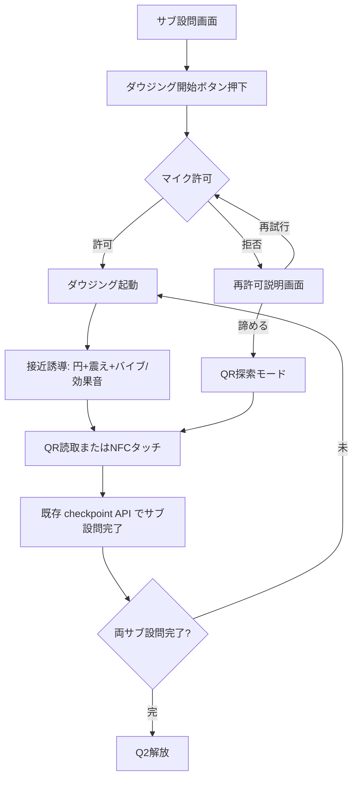
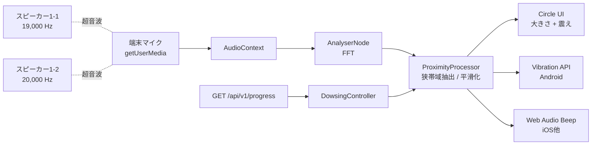
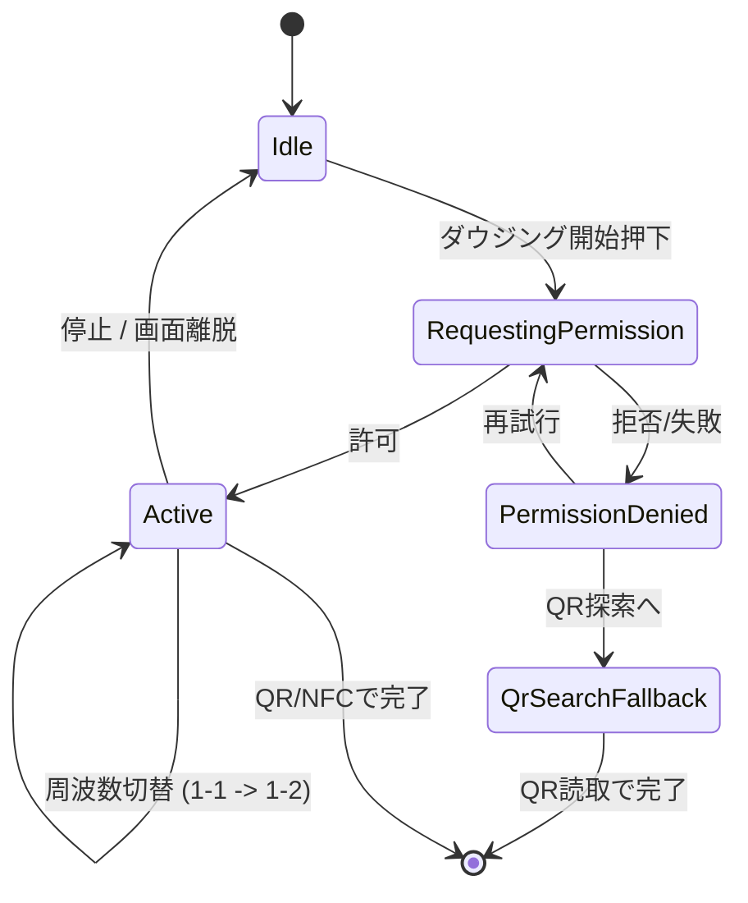

# 設計書: ダウジング機能（設問1詳細化）

author: nagomu
status: draft
updatedAt: 2026.04.27

---

## 1. 目的と前提

本書は `specs.md` 6.2（設問1: 二重ロック解除）の「ダウジング機能」を実装可能な技術仕様に落とし込むための設計書である。
対象は来場者向けモバイルブラウザ体験のうち、室内に隠されたQR/NFC地点へ来場者を音響的に誘導する部分。

採用前提:
- 実行環境: モバイルブラウザ（来場者端末）
- フロントエンド: React Router Framework Mode（既存採用）
- 利用Web API: `getUserMedia`（マイク入力）、Web Audio API（FFT、効果音生成）、Vibration API（Android）
- サブ設問の完了判定はサーバ側既存エンドポイント（`POST /api/v1/q1/:subQuestion/checkpoint`）に集約し、本機能は「探索体験の演出」のみを担う
- 1-1 / 1-2 の対象地点には超音波スピーカーとQRコード/NFCタグを共置する
- バイブレーションはAndroid端末のみ提供する。iOS等のVibration API非対応端末は効果音で代替する

---

## 2. 機能概要

### 2.1 ユースケース

来場者は対応するサブ設問の解答入力後、画面の「ダウジング開始」ボタンを押下する。マイク許可を得て、室内に隠された対象QR/NFC地点へ近づくと、画面中央の円が「大きさ」「震え振幅」で接近度を表現し、Android端末は「バイブ間隔」、iOS等は「効果音間隔」で接近度を聴覚/触覚に伝える。来場者は信号が最大になる地点でQRコード読み取り（またはNFCタッチ）を行いサブ設問を完了する。

### 2.2 体験フロー



### 2.3 スコープ

In Scope:
- ダウジング機能のクライアント実装（円ビュー・バイブ・効果音・マイク権限ハンドリング）
- 1-1 / 1-2 の周波数別評価と動的切替
- 計測不能/権限拒否時のフォールバック
- 設定パラメータ定義

Out of Scope:
- 完了判定APIの新規追加（既存 `POST /api/v1/q1/:subQuestion/checkpoint` を流用）
- スピーカーハードウェア選定・設置運用（運営側設備として別管理）
- AR描画やカメラ利用

---

## 3. アーキテクチャ

### 3.1 構成



### 3.2 責務分離

- 音声入出力層: `getUserMedia`、`AudioContext`、`AnalyserNode` の生成・解放
- 解析層: 狭帯域フィルタ、対象周波数ピーク振幅抽出、底ノイズ補正、平滑化、接近度算出
- 出力層: 円の状態（大きさ・震え振幅）、Vibration API パターン、効果音間隔
- 制御層: 起動/停止、サーバ進捗に基づく対象周波数切替、フォールバック切替

### 3.3 設計原則

- 完了判定はサーバが唯一の正データソース（既存設計を踏襲）。クライアント側ダウジング状態は完了に影響しない。
- 解放されていないサブ設問の周波数は完全に無視する（誤反応防止）。
- マイクストリームは端末内処理のみで完結。録音・送信は行わない。
- すべての可調パラメータは仕様パラメータ表（§7）で管理し、初期は静的定数として埋め込む。

### 3.4 クライアント状態



- `Active` 内では、サーバ進捗 `current_unlocked_subquestion` に応じて評価対象周波数を切り替える。

---

## 4. 信号仕様

### 4.1 周波数割当

- 1-1 サブ設問: 19,000 Hz（中心、初期値）
- 1-2 サブ設問: 20,000 Hz（中心、初期値）
- 上記は実体検証で端末マイクの平坦帯域に合わせて再調整しうる（17〜21kHz 範囲で代替候補を持つ）。

### 4.2 スピーカー側発信

- 各地点で連続正弦波を発信する。
- 出力レベルは `1〜3 m` で接近検知が可能、隣接設問の混信が最小となる値に運営側で調整する（最終値は実体検証）。
- 1-1 / 1-2 の同時鳴動を許容する（端末側で帯域分離する）。

### 4.3 端末側受信・解析

AnalyserNode 設定:
- `fftSize`: 8192（48kHzサンプリング時の周波数解像度 ≒ 5.86 Hz / bin）
- `smoothingTimeConstant`: 0.0（自前で平滑化する）

狭帯域抽出:
- 中心周波数 ± `band_half_hz` の bin のみを評価
- その範囲のピーク振幅 `peak_db` を取得

底ノイズ補正:
- 起動直後 `noise_window_ms` をキャリブレーション窓とし、対象帯域の中央値を `noise_db` として保存
- 評価時は `signal_db = max(0, peak_db - noise_db)`

接近度マッピング:
- 設計レンジ `[range_min_db, range_max_db]` に対し `signal_db` を 0〜100 に線形マッピング
- レンジ外はクランプ

平滑化:
- 指数移動平均（EMA）`proximity = (1 - α) * prev + α * raw`
- `α = ema_alpha`（実体検証で 0.2〜0.4）

### 4.4 対象周波数の切替

- `GET /api/v1/progress` で `currentUnlockedSubQuestion` を取得し、対応周波数のみを評価する。
- 1-1 完了後にポーリングまたは画面遷移で進捗が更新されたら自動で 1-2 周波数へ切替える。
- 円の見た目（色・パターン）は同一を維持する。

---

## 5. 出力仕様

### 5.1 円ビュー

- 画面中央に円を1つ表示する（両サブ設問共通の単一ビュー）。
- 大きさ: `R = R0 + (R1 - R0) * (proximity / 100) * circle_size_coef`（クランプ）
- 震え: 振幅 `A = A_max * (proximity / 100) * circle_shake_coef` で X/Y 軸ランダム変位アニメーション
- レンダリング: CSS `transform: translate(...) scale(...)` を `requestAnimationFrame` で更新
- 接近度の数値は表示しない（探索体験を維持するため）

### 5.2 バイブレーション（Android）

検出条件:
- `'vibrate' in navigator` が真
- `navigator.userAgent` に `Android` を含む

「強さ」表現はパルス間隔短縮で行う（Vibration APIに強度パラメータがないため）。

マッピング:
- `pulse_ms = vib_pulse_ms`（固定）
- `gap_ms = clamp(vib_gap_max_ms - (vib_gap_max_ms - vib_gap_min_ms) * proximity / 100, vib_gap_min_ms, vib_gap_max_ms)`
- 連続トリガ: 500ms ごとに `navigator.vibrate([pulse_ms, gap_ms, pulse_ms, gap_ms, ...])` を再呼び出し

円・バイブ・効果音の係数はそれぞれ独立に調整可能とする（§7参照）。

### 5.3 効果音（iOS等バイブ非対応端末）

- Web Audio API の `OscillatorNode` で 880 Hz 程度の短いビープを生成
- 接近度に応じてビープ間隔を短縮（マッピングはバイブと同形）
- 出力音量は中域に固定

### 5.4 起動と権限

- 「ダウジング開始」ボタン押下を起点とする（iOS Safari は AudioContext / getUserMedia ともにユーザージェスチャー必須）。
- 起動シーケンス:
  1. `navigator.mediaDevices.getUserMedia({ audio: { echoCancellation: false, noiseSuppression: false, autoGainControl: false } })`
  2. `new AudioContext()`
  3. `MediaStreamSource` -> `AnalyserNode` を接続
  4. キャリブレーション窓を実行（`noise_window_ms`）
  5. 評価ループ開始（`tick_ms` 周期）
- 停止シーケンス:
  - `MediaStreamTrack.stop()`
  - `AudioContext.close()`
  - `cancelAnimationFrame`
  - `navigator.vibrate(0)`（バイブ停止）

### 5.5 マイク拒否時の挙動

- `getUserMedia` が `NotAllowedError` を返したら再許可説明画面に遷移
- 表示内容:
  - 「ダウジングにはマイクの許可が必要です」
  - 「ページをリロードしてマイクを許可してください」（リロードボタン）
  - OS別手順アコーディオン（iOS Safari / Android Chrome の設定アプリ → サイト設定 → マイク許可）
  - 「QR探索モードで進める」リンク
- QR探索モード:
  - 円・バイブ・効果音は無効
  - 「室内に隠された2つのQRコードを探して読み取ってください」と表示
  - 完了は既存 `POST /api/v1/q1/:subQuestion/checkpoint`（`method: FALLBACK_QR`）

---

## 6. クライアント実装

### 6.1 コンポーネント候補

- `DowsingButton`: 起動/停止トリガ
- `DowsingCircle`: 接近度購読 + 円描画
- `DowsingHapticController`: Vibration API 呼び出し
- `DowsingFallbackBeep`: Web Audio API ビープ
- `DowsingFallbackPanel`: 再許可・QR探索切替
- `useProximity(targetFreqHz)`: AudioContext + AnalyserNode を内包し、接近度ストリームを返す hook

### 6.2 評価ループ擬似コード

```ts
function startDowsing(targetFreqHz: number) {
  const stream = await navigator.mediaDevices.getUserMedia({
    audio: { echoCancellation: false, noiseSuppression: false, autoGainControl: false },
  });
  const ctx = new AudioContext();
  const src = ctx.createMediaStreamSource(stream);
  const analyser = ctx.createAnalyser();
  analyser.fftSize = FFT_SIZE;
  analyser.smoothingTimeConstant = 0;
  src.connect(analyser);

  const noiseDb = await calibrate(analyser, targetFreqHz, NOISE_WINDOW_MS);
  let proximity = 0;

  const tick = () => {
    const peakDb = peakInBand(analyser, targetFreqHz, BAND_HALF_HZ);
    const signalDb = Math.max(0, peakDb - noiseDb);
    const raw = clamp((signalDb - RANGE_MIN_DB) / (RANGE_MAX_DB - RANGE_MIN_DB), 0, 1) * 100;
    proximity = (1 - EMA_ALPHA) * proximity + EMA_ALPHA * raw;
    publish(proximity);
    rafHandle = requestAnimationFrame(tick);
  };
  tick();
}
```

### 6.3 周波数切替擬似コード

```ts
useEffect(() => {
  const target = unlockedSub === "Q1_1" ? FREQ_Q1_1_HZ : FREQ_Q1_2_HZ;
  proximityChannel.setTargetFrequency(target);
}, [unlockedSub]);
```

### 6.4 エラー分類とハンドリング

| エラー | 想定原因 | クライアント挙動 |
|---|---|---|
| `NotAllowedError` | ユーザー拒否 | 再許可説明画面 |
| `NotFoundError` | マイク未搭載 | QR探索モードへ案内 |
| `NotReadableError` | 他アプリが使用中 | 「他アプリでマイク使用中です」リトライ案内 |
| `OverconstrainedError` | 制約過剰 | 制約緩めて再試行 |
| AudioContext 生成失敗 | ブラウザ非対応 | QR探索モードへ案内 |

---

## 7. 仕様パラメータ

| 名前 | 既定値（暫定） | 説明 |
|---|---|---|
| `freq_q1_1_hz` | 19000 | サブ設問1-1の中心周波数 |
| `freq_q1_2_hz` | 20000 | サブ設問1-2の中心周波数 |
| `band_half_hz` | 100 | 中心周波数からの帯域半幅 |
| `fft_size` | 8192 | AnalyserNode FFTサイズ |
| `noise_window_ms` | 1500 | キャリブレーション窓長 |
| `range_min_db` | TBD | proximity=0 にマップする `signal_db` |
| `range_max_db` | TBD | proximity=100 にマップする `signal_db` |
| `ema_alpha` | 0.3 | 接近度EMA係数 |
| `tick_ms` | 60 | 評価ループ周期 |
| `circle_size_min_px` | 80 | 円の最小直径 |
| `circle_size_max_px` | 240 | 円の最大直径 |
| `circle_shake_max_px` | 12 | 震え振幅最大値 |
| `circle_size_coef` | 1.0 | 円サイズ感度係数（独立調整） |
| `circle_shake_coef` | 1.0 | 震え振幅感度係数（独立調整） |
| `vib_pulse_ms` | 100 | バイブパルス長（固定） |
| `vib_gap_min_ms` | 60 | proximity=100時のパルス間隔 |
| `vib_gap_max_ms` | 800 | proximity=0時のパルス間隔 |
| `vib_gap_coef` | 1.0 | バイブ間隔感度係数（独立調整） |
| `beep_freq_hz` | 880 | iOSフォールバック ビープ周波数 |
| `beep_pulse_ms` | 80 | ビープパルス長 |
| `beep_gap_min_ms` | 80 | proximity=100時のビープ間隔 |
| `beep_gap_max_ms` | 900 | proximity=0時のビープ間隔 |

設計レンジは `specs.md` 6.2 の運用要件と整合させ、接近開始 1〜3m / 最大 〜30cm を狙う。最終値はすべて実体検証で確定する。

---

## 8. UI仕様

### 8.1 サブ設問画面（変更点）

- 既存の解答入力欄に加え、ダウジングカードを表示する
  - タイトル: 「ダウジングで地点を探す」
  - 説明: 「『ダウジング開始』を押すと、対象に近づくほど画面の円が大きく震えます。Android端末ではスマホが振動します。」
  - ボタン: 「ダウジング開始」
- 起動後はカード内が円ビュー + 「停止」ボタンに切り替わる

### 8.2 円ビュー

- 縦持ち端末で画面中央に正円を1つ表示
- 1-1 完了後の 1-2 切替時も円の見た目（色・パターン）を維持し、画面文言だけ「次の地点を探してください」に変える
- 接近度の数値・メーターは表示しない

### 8.3 再許可説明画面

- iOS Safari / Android Chrome の手順をアコーディオンで切替表示
- 「QR探索モードで進める」リンクは控えめに配置（誘導はまずダウジング再開）

### 8.4 表示テキスト（抜粋）

- 「ダウジングで地点を探す」
- 「マイクの音声は端末内処理のみで、サーバには送信されません。」
- 「ダウジングにはマイクの許可が必要です。ページをリロードして許可してください。」
- 「室内に隠された2つのQRコードを探して読み取ってください。」（QR探索モード）

---

## 9. 非機能要件・端末対応

### 9.1 ブラウザ互換性

| ブラウザ | getUserMedia | AudioContext | Vibration | 採用方針 |
|---|---|---|---|---|
| Android Chrome | 対応 | 対応 | 対応 | フル機能 |
| iOS Safari | 対応 | 対応（要ジェスチャ） | 非対応 | 円 + 効果音 |
| iOS Chrome (WebKit) | 対応 | 対応 | 非対応 | 円 + 効果音 |
| Android Firefox | 対応 | 対応 | 部分対応 | 円 + 効果音（バイブ条件付き） |
| その他 | 要確認 | 要確認 | 要確認 | QR探索モードへフォールバック |

### 9.2 性能

- 評価ループ p95 16ms 以内（60fps を阻害しない）
- 起動から最初の接近度出力まで p95 2.5秒以内（キャリブレーション窓含む）
- バイブ再呼び出し周期（500ms）でメインスレッドを長時間占有しない

### 9.3 プライバシ

- マイクストリームは録音・送信しない（クライアント解析のみ）
- 解析結果（接近度・周波数）もサーバに送信しない
- マイク使用中はOS標準のインジケータが表示されることを許容（説明文に補足）

### 9.4 端末負荷

- 評価ループは `requestAnimationFrame` で駆動、ページ非アクティブ時は停止
- 不要時に `AudioContext.close()` と `MediaStreamTrack.stop()` を呼ぶ
- 連続稼働時間は最大10分を想定（Q1滞留の上限を超える場合は再起動を促す）

### 9.5 アクセシビリティ

- バイブ非対応・音響制限（消音設定）の場合は円の視覚演出のみで進められる
- 「QR探索モード」を常に提示し、ダウジング機能を必須としない設計

---

## 10. 受け入れ条件（Given/When/Then）

- Given Q1の対応サブ設問解放中, When 「ダウジング開始」押下後にマイクが許可される, Then 対応周波数の評価ループが開始する。
- Given 評価ループ稼働中, When 端末が音源に近づき信号が強まる, Then 接近度が単調増加し、円の大きさ・震え振幅が増加する。
- Given Android端末で評価ループ稼働中, When 接近度が高まる, Then `navigator.vibrate` のパルス間隔が短縮される。
- Given バイブ非対応端末, When 接近度が高まる, Then 効果音のビープ間隔が短縮される。
- Given 1-1 完了直後, When サーバ進捗が `Q1_2` へ切替, Then 評価対象周波数が 1-2 中心周波数に切り替わり、円ビューは継続表示される。
- Given 解放中サブ設問の音源だけが鳴っている, When 未解放側の周波数も同時受信する状況, Then 解放中側信号にのみ反応する。
- Given 短時間の環境ノイズ, When 接近度を計算, Then 平滑化により急峻な変化が抑制され、円の表示が暴れない。
- Given マイク許可拒否, When 「ダウジング開始」押下, Then 再許可説明画面が表示され、リロード手順 / OS別設定手順 / QR探索モードへの切替リンクが提示される。
- Given 評価ループ稼働中, When ページ離脱もしくはタブ非アクティブ化, Then マイクストリームと AudioContext がクローズされる。
- Given QR探索モード, When 対象地点のQRを読み取る, Then 既存 `POST /api/v1/q1/:subQuestion/checkpoint` が `method: FALLBACK_QR` で呼ばれサブ設問が完了する。

---

## 11. 既存仕様との整合

- `specs.md` 6.2.1 の「音源検出はQ1の必須ギミック」「平滑化」「別周波数」「フォールバックQR」要件を引き継ぐ
- `specs.md` 6.2.1 の「外周点滅周期」「数値メーター」表現は本書の「円・バイブ・効果音」表現で置換する
- 完了判定は `tech-specs.md` 4.3 の `POST /api/v1/q1/:subQuestion/checkpoint` を流用し、本機能でサーバ側に新規エンドポイントは追加しない
- `tech-specs.md` 11.2 「ARモック → 本実装」の本実装版が本書に該当する
- 設定パラメータは静的定数として実装し、必要なら将来 KV `cfg:dowsing:v1` に切り出す（初期はソース埋め込みで可）

---

## 12. 未確定事項

1. 周波数の最終値（端末スピーカー/マイク特性で19/20kHzが鈍る場合の代替帯域）
2. `range_min_db` / `range_max_db` の確定値（実体検証）
3. `ema_alpha` の確定値（0.2〜0.4 範囲で実測）
4. スピーカー出力レベルと部屋スケールに対する 1〜3m / 〜30cm 設計レンジの達成可否
5. Android Firefox / 古い iOS など端末別フォールバック判定の細部
6. 円ビューのモーション仕様（CSS transform で十分か、Lottie 等を採用するか）
7. 「ダウジング」名称のUI表示文言（プロダクト用語との整合）
